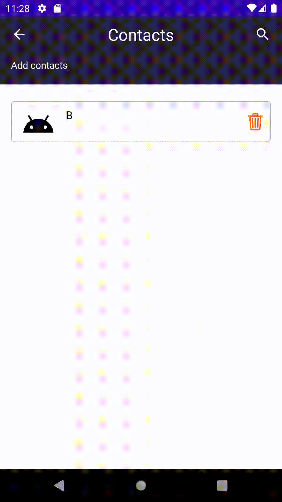

# Удаление пользователя из списка контактов
Чтобы удалить пользователя из списка контактов необходимо нажать на изображение корзины в поле информации о контакте или же свайпнуть влево.
Ниже предоставлена наглядная демонстрация удаления контакта посредством свайпа

