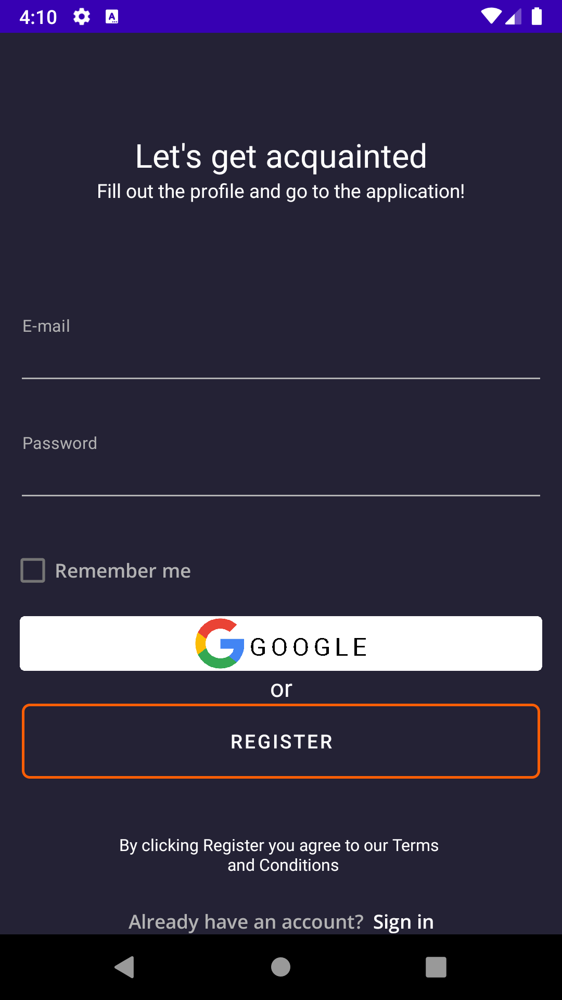
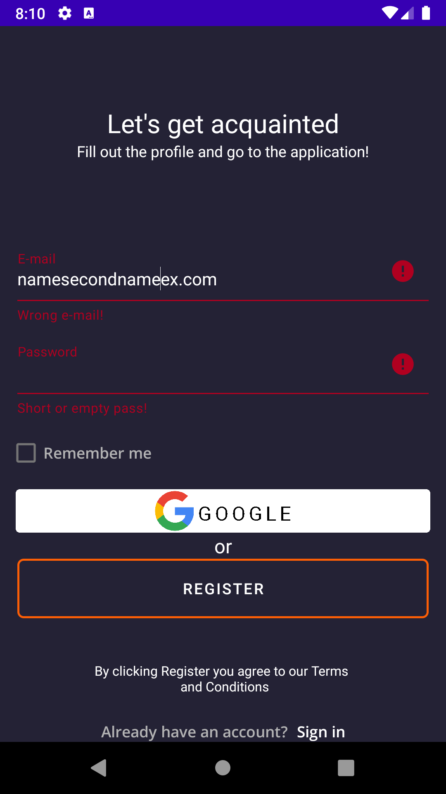

# Авторизация в Приложении:
При запуске Приложения на экране откроется окно авторизации пользователя.
Окно содержит:
  * подсказки для пользователя: 
      + Fill out the profile and go to the application!
      + By clicking Register you agree to our Terms and Conditions
      + Already have an account? 
      + Sign in
  * поля: **E-mail**, **Password**
  * чекбокс **Remember me**
  * кнопки: **Google**, **Register**
  
Для авторизации в приложении введите e-mail и пароль, которые были указаны при регистрации.

После этого нажмите кнопку **Register me**.

Если поля **E-mail** и **Password** заполнены корректно - вы будете авторизованы в приложении и перейдете в раздел профиля пользователя.

Если в заполнении полей **E-mail** и **Password** были допущены ошибки соответствующие поля будут подсвечены красным, авторизации не произойдет.

Также при авторизации вы можете воспользоваться опцией **Remember me**. Эта опция позволит при следующем открытии Приложения пройти автоматическую авторизацию. Для этого, после заполнения полей **E-mail** и **Password** установите флаг **Remember me** и нажмите кнопку **Register**.

Регистрация/авторизация|Ошибки при регистрации/авторизации | 
-------------|-----------------| 
  |  
