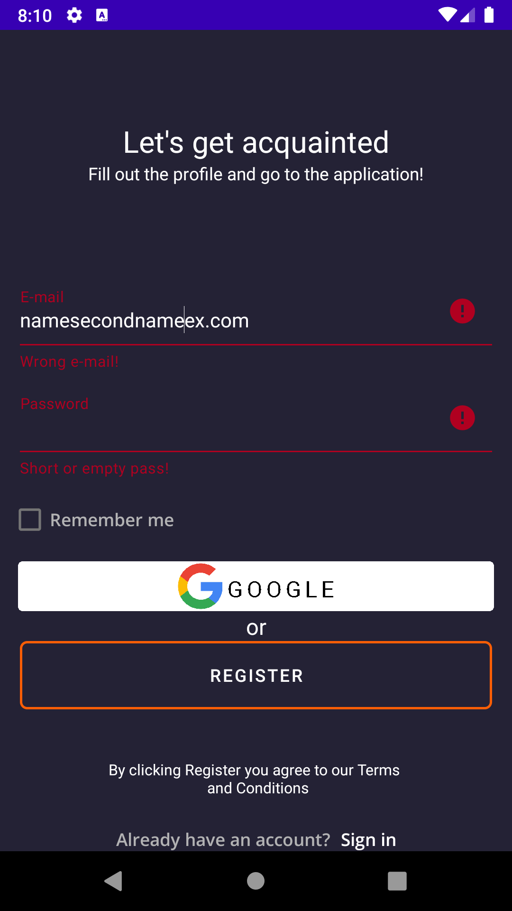

# Регистрация в Приложении:
При первом запуске Приложения на экране откроется окно регистрации нового пользователя. 
Окно содержит:
  * подсказки для пользователя: 
      + Fill out the profile and go to the application!
      + By clicking Register you agree to our Terms and Conditions
      + Already have an account? 
      + Sign in
  * поля: **E-mail**, **Password**
  * чекбокс **Remember me**
  * кнопки: **Google**, **Register**
  
Для регистрации в приложении необходимо в поле **E-mail** указать ваш e-mail в формате **name.secondname@example.com**. Также необходимо придумать пароль, состоящий из букв латинского алфавита и цифр и содержащий не менее семи символов и ввести его в поле **Password**.

После этого нажмите кнопку **Register me**.

Если поля **E-mail** и **Password** заполнены корректно - вы будете зарегистрированы в приложении и автоматически перейдете в раздел профиля пользователя.

Если в заполнении полей **E-mail** и **Password** были допущены ошибки соответствующие поля будут подсвечены красным, регистрация не произойдет.

Также при регистрации вы можете воспользоваться опцией **Remember me**. Эта опция позволит при следующем открытии Приложения пройти автоматическую авторизацию. Для этого, после заполнения полей **E-mail** и **Password** установите флаг **Remember me** и нажмите кнопку **Register**.

Регистрация/авторизация|Ошибки при регистрации/авторизации | 
-------------|-----------------| 
  |  
